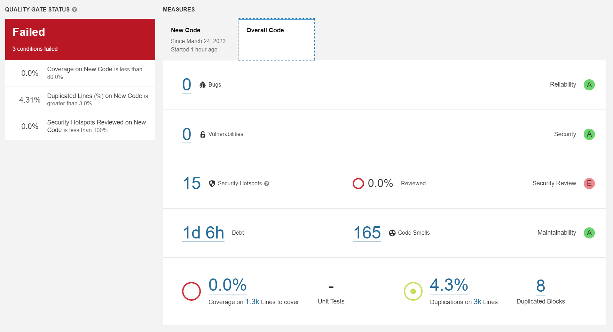
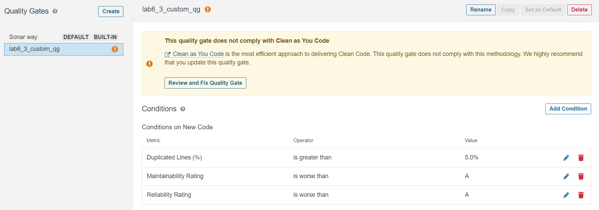
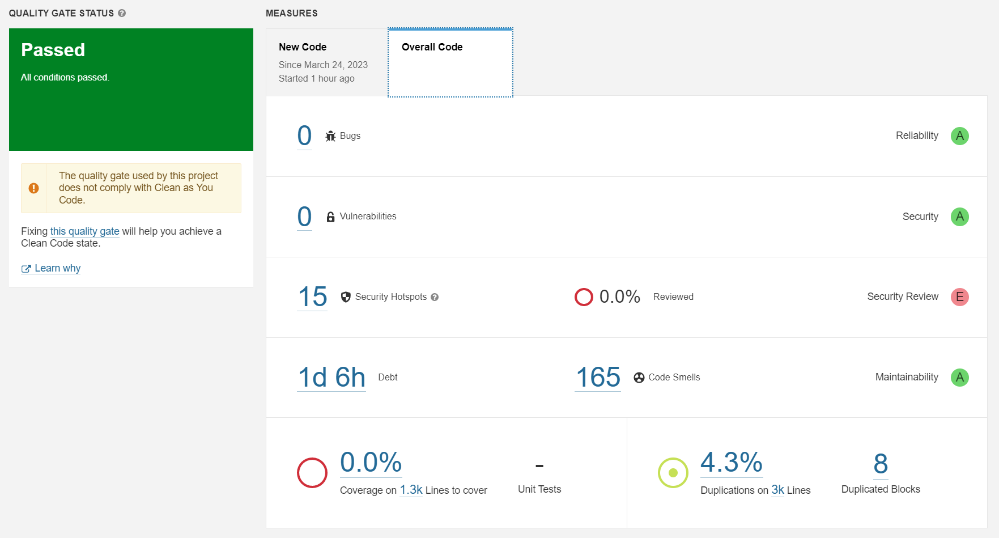
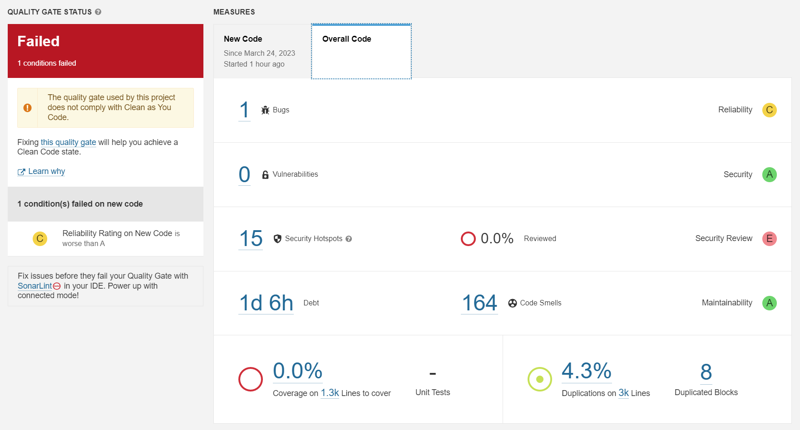
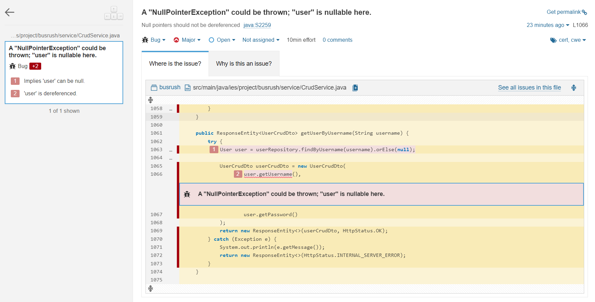

# TQS - Lab activities

## Lab 1 - Unit testing (with JUnit 5)

### 1.2 - Euromillions

#### 2.c - Assessing the test coverage using JaCoCo

##### Steps

1. Declare **JaCoCo** inside *pom.xml* plugins.

```xml
<plugin>
    <groupId>org.jacoco</groupId>
    <artifactId>jacoco-maven-plugin</artifactId>
    <version>0.8.8</version>
    <executions>
        <execution>
            <goals>
                <goal>prepare-agent</goal>
            </goals>
        </execution>
        <execution>
            <id>report</id>
            <phase>prepare-package</phase>
            <goals>
                <goal>report</goal>
            </goals>
        </execution>
    </executions>
</plugin>
```

2. Run `mvn clean test jacoco:report` to execute **test** and **jacoco:report** goals.

3. The HTML report should be under *target/site/jacoco*.

##### Questions

**I. Which classes/methods offer less coverage?** 

As a rule of thumb, unit tests should cover at least 80% of the class. The following table presents some examples of low instruction coverage in the project.

| Package          | Class                | Instruction Coverage | Methods                                                                                                                                         |
| ---------------- | -------------------- | -------------------- | ----------------------------------------------------------------------------------------------------------------------------------------------- |
| tqs.euromillions | CuponEuroMillions    | 34%                  | format() (0%)<br/>countDips() (0%)                                                                                                              |
| tqs.sets         | BoundedSetOfNaturals | 54%                  | fromArray(int[]) (0%)<br/>add(int) (56%)<br/>hashCode() (0%)<br/>equals(Object) (76%)<br/>size() (0%)<br/>intersects(BoundedSetOfNaturals) (0%) |

**II. Are all possible [decision] branches being covered?**
No. The following table presents some examples of low branch coverage in the project.

| Package          | Class                     | Branch Coverage |
| ---------------- | ------------------------- | --------------- |
| tqs.euromillions | CuponEuromillions<br/>Dip | 0%<br/>77%      |
| tqs.sets         | BoundedSetOfNaturals      | 50%             |

**III. Collect evidence of the coverage for “BoundedSetOfNaturals”.**

According to JaCoCo, this class has:

- a instruction coverage of 54%;

- a branch coverage of 50%.

**IV. What kind of unit tests are worth writing for proper validation of BoundedSetOfNaturals?**

Taking into consideration the expected contract of the class, we should test for:

- addition of numbers not found in a set;

- addition of numbers already in a set;

- presence of all natural numbers;

- max size of a set;

- set operations (contains, intersection).

#### 2.d - BoundedSetOfNaturals before and after results

| Method                           | Instruction Coverage - Before (54%) | Branch Coverage - Before (50%) | Instruction Coverage - After (87%) | Branch Coverage - After (80%) |
| -------------------------------- | ----------------------------------- | ------------------------------ | ---------------------------------- | ----------------------------- |
| add(int)                         | 56%                                 | 50%                            | 83%                                | 83%                           |
| add(int[])                       | 100%                                | 100%                           | 100%                               | 100%                          |
| BoundedSetOfNaturals(int)        | 100%                                | -                              | 100%                               | -                             |
| contains(Integer)                | 100%                                | -                              | 100%                               | -                             |
| equals(Object)                   | 76%                                 | 50%                            | 76%                                | 50%                           |
| fromArray(int[])                 | 0%                                  | 0%                             | 100%                               | 100%                          |
| hashCode()                       | 0%                                  | -                              | 0%                                 | -                             |
| intersects(BoundedSetOfNaturals) | 0%                                  | -                              | 100%                               | 100%                          |
| iterator()                       | 100%                                | -                              | 100%                               | -                             |
| maxSize()                        | -                                   | -                              | 100%                               | -                             |
| size()                           | 0%                                  | -                              | 100%                               | -                             |

## Lab 2 - Mocking dependencies (for unit testing)

### 2.1 - Stocks portfolio

#### 1.a - Test for StockPortfolio#getTotalValue

##### Setup

1. Add **Mockito** to *pom.xml*.
   
   ```xml
   <dependency>
       <groupId>org.mockito</groupId>
       <artifactId>mockito-junit-jupiter</artifactId>
       <version>5.1.1</version>
       <scope>test</scope>
   </dependency>
   ```

2. Add the **@ExtendWith** annotation to integrate the Mockito framework.
   
   ```java
   @ExtendWith(MockitoExtension.class)
   class StocksPortfolioTest { ... }
   ```

3. Add the **@MockitoSettings** annotation to avoid exceptions on unused stubs.
   
   ```java
   @MockitoSettings(strictness = Strictness.LENIENT)
   class StocksPortfolioTest { ... }
   ```

##### Outline

1. Prepare a mock to substitute the remote service (@Mock annotation).
   
   ```java
   @Mock
   IStockmarketService market;
   ```

2. Create an instance of the subject under test (SuT) and use the mock to set the (remote) service instance.
   
   ```java
    @InjectMocks
    StocksPortfolio portfolio;
   ```

3. Load the mock with the proper expectations (when...thenReturn)
   
   ```java
   @Test
   public void getTotalValue() {
       when(market.lookUpPrice("EBAY")).thenReturn(4.0);
       when(market.lookUpPrice("MSFT")).thenReturn(1.5);
       when(market.lookUpPrice("NOTUSED")).thenReturn(1.5);
       // ...
   }
   ```

4. Execute the test (use the service in the SuT)
   
   ```java
   @Test
   public void getTotalValue() {
       // ...
       portfolio.addStock(new Stock("EBAY", 2));
       portfolio.addStock(new Stock("MSFT", 4));
       double result = portfolio.getTotalValue();
       // ...
   }
   ```

5. Verify the result (assert) and the use of the mock (verify)
   
   ```java
   @Test
   public void getTotalValue() {
       // ...
       assertThat(result, equalTo(14.0));
   }
   ```

#### 1.b - Hamcrest library

##### Setup

1. Add **Hamcrest** to *pom.xml*.
   
   ```xml
   <dependency>
       <groupId>org.hamcrest</groupId>
       <artifactId>hamcrest-all</artifactId>
       <version>1.3</version>
   </dependency>
   ```

##### Usage

1. Replace **JUnit** core asserts with more human-readable assertions from the **Hamcrest** library.
   
   ```java
   // assertEquals(14.0, result);
   assertThat(result, equalTo(14.0));
   ```

### 2.2 - Geocoding

#### 2.b - Testing AddressResolver#findAddressForLocation

##### Questions

**I. Which is the SuT (subject under test)?**

The SuT is the class **AddressResolver**.

**II. Which is the service to *mock*?**

The service to mock is the **MapQuest API**.

### 2.3 - Integration

- Integration tests invoke the **real services**, not a mock as in unit tests. 

- We **don't need to have any mocks** in integration tests.

- Integration tests might take more time to run (seconds) than unit tests (milliseconds).

##### Maven conventions

We should follow the **Maven** class naming convention for tests.

| Type              | Naming Convention                |
| ----------------- | -------------------------------- |
| Unit Tests        | **Test... {}** or **...Test {}** |
| Integration Tests | **...IT {}**                     |

##### Some Maven commands

| Command                       | Description             |
| ----------------------------- | ----------------------- |
| mvn test                      | Runs unit tests.        |
| mvn package                   | Runs unit tests.        |
| mvn package -Dskiptests=true  | Skips unit tests.       |
| mvn failsafe:integration-test | Runs integration tests. |

## Lab 3 - Multi-layer application testing (with Spring Boot)

##### Key concepts

- **@SpringBootTest:** loads entire application context.

- **@DataJpaTest:** only loads @Repository components.

- **@WebMvcTest:** used to test REST APIs exposed through controllers. Beans used by controller need to be mocked.

- Isolate the functionality to be tested by limiting the context of loaded frameworks/components. In some cases we can get away with standard unit testing.

### 3.1 - Employee manager example

##### Questions

**a) Identify a couple of examples that use AssertJ expressive methods chaining.**

|                                                                                                           | Line                                           | Example                                                                                                                                                                                                                                                                                                                                                                                                  |
| --------------------------------------------------------------------------------------------------------- | ---------------------------------------------- | -------------------------------------------------------------------------------------------------------------------------------------------------------------------------------------------------------------------------------------------------------------------------------------------------------------------------------------------------------------------------------------------------------- |
| **A_EmployeeRepositoryTest**                                                                              | 37<br/>43<br/>52<br/>53<br/>59<br/>75          | assertThat(found).isEqualTo(alex);<br/>assertThat(fromDb).isNull();<br/>assertThat(fromDb).isNotNull();<br/>assertThat(fromDb.getEmail()).isEqualTo(emp.getEmail());<br/>assertThat(fromDb).isNull();<br/>assertThat(allEmployees).hasSize(3).extracting(Employee::getName).containsOnly(alex.getName(), ron.getName(), bob.getName());                                                                  |
| **B_EmployeeService_UnitTest**                                                                            | 63<br/>69<br/>77<br/>85<br/>93<br/>102<br/>113 | assertThat(found.getName()).isEqualTo(name);<br/>assertThat(fromDb).isNull();<br/>assertThat(doesEmployeeExist).isEqualTo(true);<br/>assertThat(doesEmployeeExist).isEqualTo(false);<br/>assertThat(fromDb.getName()).isEqualTo("john");<br/>assertThat(fromDb).isNull();<br/>assertThat(allEmployees).hasSize(3).extracting(Employee::getName).contains(alex.getName(), john.getName(), bob.getName()); |
| **C_EmployeeController_WithMockServiceTest**                                                              | N/A                                            | N/A                                                                                                                                                                                                                                                                                                                                                                                                      |
| **D_EmployeeRestControllerIT**                                                                            | 58                                             | assertThat(found).extracting(Employee::getName).containsOnly("bob");                                                                                                                                                                                                                                                                                                                                     |
| **E_EmployeeRestControllerTemplateIT**                                                                    | 53<br/>66<br/>67                               | assertThat(found).extracting(Employee::getName).containsOnly("bob");<br/>assertThat(response.getStatusCode()).isEqualTo(HttpStatus.OK);                                                                                                                                                                                                                                                                  |
| <br/>        assertThat(response.getBody()).extracting(Employee::getName).containsExactly("bob", "alex"); |                                                |                                                                                                                                                                                                                                                                                                                                                                                                          |

**b) Identify an example in which you mock the behavior of the repository (and avoid involving a database).**
In **B_EmployeeService_UnitTest** we mock the behaviour of the repository with **Mockito**.

```java
@ExtendWith(MockitoExtension.class)
class B_EmployeeService_UnitTest {

    @Mock(lenient = true)
    private EmployeeRepository employeeRepository;
    // ...

    @BeforeEach
    public void setUp() {
        // ...
        Employee alex = new Employee("alex", "alex@deti.com");
        // ...
        Mockito.when(employeeRepository.findByName(alex.getName())).thenReturn(alex);
        // ...
    }

    @Test
    void whenSearchValidName_thenEmployeeShouldBeFound() {
        String name = "alex";
        Employee found = employeeService.getEmployeeByName(name);

        assertThat(found.getName()).isEqualTo(name);
    }
}
```

**c) What is the difference between standard @Mock and @MockBean?**

- **@Mock:** anotation from **Mockito** used for unit testing. Creates a mock object of a class or an interface.

- **@MockBean:** anotation from **SpringBoot** used for integration testing. Replaces a Spring bean with a mock object.

**d) What is the role of the file “application-integrationtest.properties”? In which conditions will it be used?**

The file is a SpringBoot properties file for configuring integrations tests. It overrides similar configurations that are contained in the default configuration properties, *application.properties*, located in *src/main/resources/*.

**Example:** We use a hosted MySQL database in production, but want to a local MySQL database for testing. Inside *application-integrationtest.properties* we should have the following configurations:

```properties
# application-integrationtest.properties
spring.datasource.url=jdbc:mysql://localhost:33060/tqsdemo
spring.jpa.hibernate.ddl-auto=create-drop
spring.datasource.username=demo
spring.datasource.password=demo
```

To load these configurations, we should use the anotation **@TestPropertySource** in the integration test:

```java
@TestPropertySource(locations = "application-integrationtest.properties")
class D_EmployeeRestControllerIT { ... }
```

**e) The sample project demonstrates three test strategies to assess an API (C, D and E) developed with SpringBoot. Which are the main/key differences?**

| Strategy | What's Tested                  | Characteristics                                                                                                                                                                                                                                                                              |
| -------- | ------------------------------ | -------------------------------------------------------------------------------------------------------------------------------------------------------------------------------------------------------------------------------------------------------------------------------------------- |
| C        | Controller                     | Simple and light environment;<br/>Simulates the behaviour of an application server (**@WebMvcTest** anotation);<br/>The server context is accessed through a special testing servlet (**MockMvc** object), that provides an expressive API which supports method chaining to build the mock. |
| D        | Full App with MockMvc          | Exercises all the layers of the SpringBoot application (**@SpringBootTest**);<br/>The server context is accessed through a <u>special testing servlet</u> (**MockMvc** object), that provides an expressive API which supports method chaining to build the mock.                            |
| E        | Full App with TestRestTemplate | Exercises all the layers of the SpringBoot application (**@SpringBootTest**);<br/>The requests to the server are made by an <u>API client</u> (**TestRestTemplate** object), which involves the un/marshaling of the messages.                                                               |

### 3.2 - Cars service

#### 2.a - CarController Test

The following code tests the POST */api/cars* endpoint using a **MockMvc** instance (mvc) and a **@MockBean** of the **CarManagerService** instance (service).

```java
@WebMvcTest(CarController.class)
public class a_CarControllerTest {

    @Autowired
    private MockMvc mvc;

    @MockBean
    private CarManagerService service;
    // ...

    @Test
    void whenPostCar_thenCreateCar() throws Exception {
        Car opel = new Car("Opel", "Astra");

        // Loads the service mock with the proper expectation
        when(service.save(opel)).thenReturn(opel);

        // Performs the request and expects certain results
        mvc.perform(post("/api/cars")
                        .contentType(MediaType.APPLICATION_JSON)
                        .content(JsonUtils.toJson(opel)))
                .andExpect(status().isCreated())
                .andExpect(jsonPath("$.maker", is("Opel")))
                .andExpect(jsonPath("$.model", is("Astra")));

        // Verifies that service#save was only called once
        verify(service, times(1)).save(Mockito.any());
    } 
    // ...
}
```

#### 2.b - CarManagerService Test

The following code sets up the mock repository, that is injected into the service with the anotation **@InjectMocks**, and tests the service using it. This is a strandard unit test without envolvement of the tests features of Spring Boot.

```java
@ExtendWith(MockitoExtension.class)
public class b_CarManagerServiceTest {

    @Mock(lenient = true)
    private CarRepository repository;

    @InjectMocks
    private CarManagerService service;

    @BeforeEach
    public void setUp() {
        Car opel = new Car("Opel", "Astra");
        Car honda = new Car("Honda", "Civic");
        Car mazda = new Car("Mazda", "3");

        List<Car> allCars = List.of(opel, honda, mazda);

        // Loads the mock repository with the proper expectations
        when(repository.findByCarId(0L)).thenReturn(opel);
        when(repository.findByCarId(1L)).thenReturn(honda);
        when(repository.findByCarId(2L)).thenReturn(mazda);
        when(repository.findByCarId(3L)).thenReturn(null);
        when(repository.findAll()).thenReturn(allCars);
    }

    @Test
    void whenValidId_thenCarShouldExist() {
        Optional<Car> car = service.getCarDetails(0L);
        assertThat(car.isPresent()).isTrue();

        verify(repository, times(1)).findByCarId(0L);
    }
    // ...
}
```

#### 2.c - CarRepository Test

The following code tests the repository using an **TestEntityManager** instance that adds the entities to the database. After that, the repository is used to retrive the entities.

```java
@DataJpaTest
public class c_CarRepositoryTest {

    @Autowired
    private TestEntityManager entityManager;

    @Autowired
    private CarRepository repository;

    @Test
    void whenFindByCarId_thenReturnCar() {
        Car opel = new Car("Opel", "Astra");
        entityManager.persistAndFlush(opel);

        Car found = repository.findByCarId(opel.getCarId());
        assertThat(found).isEqualTo(opel);
    }
    // ...
}
```

#### 2.d - Integration Test

The following code test the API as a whole using an **TestRestTemplate** instance that acts as a REST client and creates realistic requests involving un/marshalling of the messages. The test database is the in-memory solution H2, and it's automatically configured, as expressed by the  **AutoConfigureTestDatabase** anotation.

```java
@SpringBootTest(webEnvironment = WebEnvironment.RANDOM_PORT)
@AutoConfigureTestDatabase
public class d_CarRestControllerTemplateIT {

    @LocalServerPort
    int randomServerPort;

    @Autowired
    private TestRestTemplate restTemplate;

    @Autowired
    private CarRepository repository;

    @AfterEach
    public void resetDb() {
        repository.deleteAll();
    }

    @Test
    public void whenValidInput_thenCreateCar() {
        Car opel = new Car("Opel", "Astra");
        ResponseEntity<Car> entity = restTemplate.postForEntity("/api/cars", opel, Car.class);

        List<Car> found = repository.findAll();
        assertThat(found).extracting(Car::getMaker).containsOnly(opel.getMaker());
    }
    // ...
}
```

### 3.3 - Integration Test (with a real database)

Taking the previous developed integration test, we will now use a real database instead of the in-memory solution H2.

##### Setup

1. Start an instance of **MySQL** inside a Docker container.
   
   ```bash
   docker run --name tqs_lab3_3 -e MYSQL_ROOT_PASSWORD=root -e MYSQL_DATABASE=tqs_lab3_3 -e MYSQL_USER=user -e MYSQL_PASSWORD=user -p 33060:3306 -d mysql/mysql-server:5.7
   ```

2. Include a dependency for **MySQL** inside the project's *pom.xml*.
   
   ```xml
   <dependency>
       <groupId>mysql</groupId>
       <artifactId>mysql-connector-java</artifactId>
       <scope>runtime</scope>
   </dependency>
   ```

3. Add *application-integrationtest.properties* inside *src/test/resources/tqs/lab3/lab3_2_cars_service/*. This file should <u>follow the folder structure where the tests are located</u>, *src/test/java/tqs/lab3/lab3_2_cars_service/*.
   
   ```properties
   spring.datasource.url=jdbc:mysql://localhost:33060/tqs_lab3_3
   spring.jpa.hibernate.ddl-auto=create-drop
   spring.datasource.username=user
   spring.datasource.password=user
   ```

4. Use the **@TestPropertySource** anotation instead of **@AutoConfigureTestDatabase**.
   
   ```java
   @SpringBootTest(webEnvironment = WebEnvironment.RANDOM_PORT)
   // @AutoConfigureTestDatabase
   @TestPropertySource( locations = "application-integrationtest.properties")
   public class d_CarRestControllerTemplateIT { ... }
   ```

## Lab 4 - Acceptance testing with web automation (Selenium)

##### Key concepts

- Acceptance tests exercise the user interface of the system, simulate the actions of a real user, and treat the system as a black box.

- **Selenium:** browser automation framework, that provides the WebDriver API (Java).

- **Page Objects Pattern:** tranforms hard to read code generated by Selenium into modules (methods).

### 4.1 - WebDriver starter

##### Setup

1. Install the **Selenium** library and Boni Garcia's **WebDriverManager**.
   
   ```xml
   <dependency>
       <groupId>org.seleniumhq.selenium</groupId>
       <artifactId>selenium-java</artifactId>
       <version>4.8.0</version>
   </dependency>
   <dependency>
       <groupId>io.github.bonigarcia</groupId>
       <artifactId>webdrivermanager</artifactId>
       <version>5.3.2</version>
       <scope>test</scope>
   </dependency>
   ```

2. Install the drivers (recommended method)
   
   1. Import **WebDriverManager**.
      
      ```java
      import io.github.bonigarcia.wdm.WebDriverManager;
      ```
   
   2. Call **setup()**.
      
      ```java
      WebDriverManager.chromedriver().setup();
      WebDriver driver = new ChromeDriver();
      ```

### 4.2 - Selenium IDE recorder

##### Setup

1. Download the addon from [here](https://www.selenium.dev/selenium-ide/).

##### Selenium-Jupiter Extension

Using the anotation **@ExtendWith(SeleniumJupiter.class)**, from `io.github.bonigarcia.seljup`, on the test class, we don't need to explicitly setup, instanciate and quit the web driver. We can just pass the driver as an argument in the test method.

```java
@ExtendWith(SeleniumJupiter.class)
public class HelloSeleniumExtensionTest {
    // ...
    @Test
    void test(ChromeDriver driver) {
        // ...
    }
}
```

### 4.3 - Page Object pattern

Design pattern in Selenium, where **webpages** are represented as **classes**:

- <u>elements</u> (of interest) on the page are defined as <u>variables</u>;

- <u>user interactions</u> (on the page) can then be implemented as <u>methods</u>.

### 4.4 - Docker browsers

To use a browser running in a Docker container, we only need to change the test class (and have Docker installed on our machine, of course). Using this approach, the **WebDriver** will connect to a **remote browser**.

```java
@ExtendWith(SeleniumJupiter.class)
public class HelloSeleniumExtensionTest {
    // ...
    @Test
    void test(@DockerBrowser(type = CHROME) WebDriver driver) {
        // ...
    }
}
```

## Lab 5 - Behavior-driven development (Cucumber)

##### Key concepts

- **Gherkin:** used to describe features (tests scenarios) in a language readable by non-programmers.

- **Cucumber:** executes features written in Gherkin.

- Each step in a scenario is mapped into a Java test method, by annotating them with matching expressions (Regex or Cucumber expessions).

### 5.1 - Getting started

A `.feature` will match with a "test runner" class that activates the test steps inside the same package. This class should be anotated with:

- **@Suite**

- **@IncludeEngines("cucumber")**

- **@SelectClasspathResource("tqs/lab5/lab5_1_getting_started")**

### 5.2 - Books

##### Cucumber parameter types

| Parameter Type | Description                                                                                                                                                                                                                                                                                                       |
| -------------- | ----------------------------------------------------------------------------------------------------------------------------------------------------------------------------------------------------------------------------------------------------------------------------------------------------------------- |
| `{int}`        | Matches integers, for example `71` or `-19`. Converts to a 32-bit signed integer if the platform supports it.                                                                                                                                                                                                     |
| `{float}`      | Matches floats, for example `3.6`, `.8` or `-9.2`. Converts to a 32 bit float if the platform supports it.                                                                                                                                                                                                        |
| `{word}`       | Matches words without whitespace, for example `banana` (but not `banana split`).                                                                                                                                                                                                                                  |
| `{string}`     | Matches single-quoted or double-quoted strings, for example `"banana split"` or `'banana split'` (but not `banana split`). Only the text between the quotes will be extracted. The quotes themselves are discarded. Empty pairs of quotes are valid and will be matched and passed to step code as empty strings. |
| `{}` anonymous | Matches anything (`/.*/`).                                                                                                                                                                                                                                                                                        |
| `{bigdecimal}` | Matches the same as `{float}`, but converts to a `BigDecimal` if the platform supports it.                                                                                                                                                                                                                        |
| `{double}`     | Matches the same as `{float}`, but converts to a 64 bit float if the platform supports it.                                                                                                                                                                                                                        |
| `{biginteger}` | Matches the same as `{int}`, but converts to a `BigInteger` if the platform supports it.                                                                                                                                                                                                                          |
| `{byte}`       | Matches the same as `{int}`, but converts to an 8 bit signed integer if the platform supports it.                                                                                                                                                                                                                 |
| `{short}`      | Matches the same as `{int}`, but converts to a 16 bit signed integer if the platform supports it.                                                                                                                                                                                                                 |
| `{long}`       | Matches the same as `{int}`, but converts to a 64 bit signed integer if the platform supports it.                                                                                                                                                                                                                 |

To handle dates or <u>parameter types not supported</u> by Cucumber, use **@ParameterType** and use a matching expression inside brackets:

```java
@ParameterType("([0-9]{4})-([0-9]{2})-([0-9]{2})")
public LocalDate iso8601Date(String year, String month, String day) {
    return Utils.isoTextToLocalDate(year, month, day);
}
```

To handle <u>data tables</u> in the feature description, use **@DataTableType** which converts each row of the table into a key-value pair of Strings (where the key is the name of the column):

```java
@DataTableType
public Book bookEntry(Map<String, String> entry) {
    return new Book(
            entry.get("title"),
            entry.get("author"),
            Utils.isoTextToLocalDate(entry.get("published")));
}

@Given("the library has the following books:")
public void addBooks(List<Book> books) {
    books.forEach(library::addBook);
}
```

### 5.3 - Web automation

The test scenario was adapted from the previous laboratory exercises:

```gherkin
Feature: BlazeDemo

  Scenario: Buying a trip
    When I navigate to 'https://blazedemo.com'
    And I choose a trip from 'Boston' to 'New York'
    And I click find flights
    Then I should see the list of flights from 'Boston' to 'New York'

    When I choose the flight in row 1
    Then I should see the purchase form page

    When I fill in the form with
      | key              | value                  |
      | inputName        | João Fonseca           |
      | address          | Universidade de Aveiro |
      | city             | Aveiro                 |
      | state            | Aveiro                 |
      | zipCode          | 12345                  |
      | cardType         | Diner's Club           |
      | creditCardNumber | 12345                  |
      | creditCardMonth  | 3                      |
      | creditCardYear   | 2023                   |
      | nameOnCard       | João Fonseca           |
      | rememberMe       | True                   |
    Then I should see the remember me checkbox checked

    When I click purchase flight
    Then I should see the confirmation page
    And I should see 'BlazeDemo Confirmation' in the title
```

## Lab 6 - Static Code analysis (with SonarQube)

##### Key concepts

- **Static code analysis:** assesses a code base to produce quality metrics such as:
  
  - Problems likely to produce errors.
  
  - Vulnerabilities (security/reliability concerns).
  
  - Code smells (bad/poor practice or coding style).
  
  - Coverage (ratio tested/total).
  
  - Code complexity.

- **Technical debt:** estimated effort to correct the vulnerabilities. Used by software quality engineers to obtain realistic information of it.

- **Sonar vs linters:**
  
  - **Linter:** tool that runs and provides feedback.
  
  - **Sonar:** tool that combines several linters over different programming languages, and provides feedback through the means of an information system.

- **SonarQube:** self-hosted solution of Sonar, can be run inside a Docker container. Alternatives are SonarLint (runs in the IDE) and SonarCloud (runs as a SaaS).

### 6.1 - Local analysis

##### Installing a local instance of SonarQube

1. Run a local instance of SonarQube server using Docker.
   
   ```bash
   docker run -d --name sonarqube -e SONAR_ES_BOOTSTRAP_CHECKS_DISABLE=true -p 9000:9000 sonarqube:latest
   ```

2. Access http://localhost:9000 and insert the login credentials.
   
   - **login:** admin
   
   - **password:** admin

3. Change the credentials.

##### Analysing a project

1. Create a project *manually*.

2. Provide a name - **lab6_1_local_analysis**.

3. Analyse the project *locally*.

4. Generate a token - **sqp_04ed513da0a7242ab7498d8d84606b96635a2da6**.
   
   **Considering a Maven project**

5. Add the Sonar plugin to the *pom.xml*.
   
   ```xml
   <plugin>
       <groupId>org.sonarsource.scanner.maven</groupId>
       <artifactId>sonar-maven-plugin</artifactId>
       <version>3.9.1.2184</version>
   </plugin>
   ```

6. Run the analysis in a **Maven** project (use **CMD** instead of **Powershell**).
   
   ```bash
   mvn clean verify sonar:sonar -Dsonar.projectKey=lab6_1_local_analysis -Dsonar.host.url=http://localhost:9000 -Dsonar.login=sqp_04ed513da0a7242ab7498d8d84606b96635a2da6
   ```

##### Questions

**f) Has your project passed the defined quality gate?**

The assessed project (Euromillions from Lab 1.2) **passed** the defined quality gate. The quality gate that was considered was the built-in provided by SonarQube - **Sonar Way**.

**Conditions on New Code**

| Metric                     | Operator        | Value                                      |
| -------------------------- | --------------- | ------------------------------------------ |
| Coverage                   | is less than    | 80.0%                                      |
| Duplicated Lines (%)       | is greater than | 3.0%                                       |
| Maintainability Rating     | is worse than   | A (Technical debt ratio is less than 5.0%) |
| Reliability Rating         | is worse than   | A (No bugs)                                |
| Security Hotspots Reviewed | is less than    | 100%                                       |
| Security Rating            | is worse than   | A (No vulnerabilities)                     |

**Conditions on Overall Code**

None.

**g) Explore the analysis results and complete with a few sample issues, as applicable.**

The assessed project (Euromillions from Lab 1.2) contained **only** code smell issues.

| Issue              | Problem description                                                                                                                              | How to solve                                                                                                                                                                                   |
| ------------------ | ------------------------------------------------------------------------------------------------------------------------------------------------ | ---------------------------------------------------------------------------------------------------------------------------------------------------------------------------------------------- |
| Code smell (major) | **Invoke method(s) only conditionally.**<br>"Preconditions" and logging arguments should not require evaluation.                                 | Compute the logging arguments before passing it to the method.                                                                                                                                 |
| Code smell (major) | **Refactor the code in order to not assign to this loop counter from within the loop body.** <br>"for" loop stop conditions should be invariant. | Do not change the loop counter variable inside the loop itself. It should be invariant during an entire loop iteration, and should be only changed in the loop header, right before it begins. |

### 6.2 - Technical debt

##### SonarQube configuration

- **Name:** lab6_2_technical_debt

- **Token:** sqp_4f68bf7b3b4c588fbce70146a8e2e919435493ff

Command to run the analysis:

```bash
mvn clean verify sonar:sonar -Dsonar.projectKey=lab6_2_technical_debt -Dsonar.host.url=http://localhost:9000 -Dsonar.login=sqp_4f68bf7b3b4c588fbce70146a8e2e919435493ff
```

##### Questions

**a) Take note of the technical debt found. Explain what this value means. Document the analysis findings with a screenshot.**

The technical debt is 40 min. This value is a measure of the effort required to fix all code smells. When the value is shown in days, it is assumed a 8-hour day.


**b) Correct the severe (critical and major) code smells.**

There were no code smells in those categories.

**d) Run the static analysis with coverage enabled (by adding the jacoco plugin). How many lines are "not covered"? And how many conditions?**

There are 5 uncovered lines and 31 uncovered conditions


### 6.3 - Custom QG

For this exercise, I considered the backend module of my IES group project, available [here](https://github.com/BusRush/IES_Project/tree/main/busrush).

##### SonarQube configuration

- **Name:** lab6_3_custom_qg

- **Token:** sqp_326aca85210da606594345e943adc2de3693c85e

Command to run the analysis:

```bash
mvn clean verify sonar:sonar -Dsonar.projectKey=lab6_3_custom_qg -Dsonar.host.url=http://localhost:9000 -Dsonar.login=sqp_326aca85210da606594345e943adc2de3693c85e -Dmaven.test.skip=true
```

For this analysis to work, I had to disable the SCM sensor in SonarQube project settings, otherwise it wouldn't detect any source files.

#### 3.a - Defining a custom Quality Gate

After a first analysis, this was the resulting dashboard.



To define the custom Quality Gate, the following ideas were taken into account:

- **Code Coverage:** removed, no tests were created at the time.

- **Duplicated Lines (5%):** increased to 5%, it is still an acceptable amount.

- **Maintainability Rating:** kept the same, complies with the Clean as You Code methodology.

- **Reliability Rating:** maintained, complies with the Clean as You Code methodology.

- **Security Hotspots Reviewed:** removed, it wasn't considered at the time.

- **Security Rating:** removed, it wasn't considered at the time.

In the end, it doesn't fully comply to the Clean as You Code methodology, but it needs to be taking into account that the project was developed without following it.



Applying this quality gate to the project, after another analysis these were the results.



To break the quality gate, we could just introduce **1 bug**. A simple bug is the very popular NullPointerException, that occurs when a variable's attributes/methods are tried to be accessed, altought its value is null. <br>

Let's consider the following piece of working code.

```java
public ResponseEntity<UserCrudDto> getUserByUsername(String username) {
    try {
        Optional<User> _user = userRepository.findByUsername(username);
        if (_user.isEmpty())
            return new ResponseEntity<>(HttpStatus.NOT_FOUND);
        User user = _user.get();

        UserCrudDto userCrudDto = new UserCrudDto(
                user.getUsername(),
                user.getPassword()
        );
        return new ResponseEntity<>(userCrudDto, HttpStatus.OK);
    } catch (Exception e) {
        System.out.println(e.getMessage());
        return new ResponseEntity<>(HttpStatus.INTERNAL_SERVER_ERROR);
    }
}
```

Let's introduce a possible NullPointerException, by trying to access **user#getUsername** when **user** is null.

```java
public ResponseEntity<UserCrudDto> getUserByUsername(String username) {
    try {
        User user = userRepository.findByUsername(username).orElse(null);

        UserCrudDto userCrudDto = new UserCrudDto(
                user.getUsername(),
                user.getPassword()
        );
        return new ResponseEntity<>(userCrudDto, HttpStatus.OK);
    } catch (Exception e) {
        System.out.println(e.getMessage());
        return new ResponseEntity<>(HttpStatus.INTERNAL_SERVER_ERROR);
    }
}
```

After another analysis these were the results.





By viewing the dashboard, we can clearly see the quality gate was broken, and the bug it detected in the analysis was the one we introduced in the code. The reliability went from A to C.
